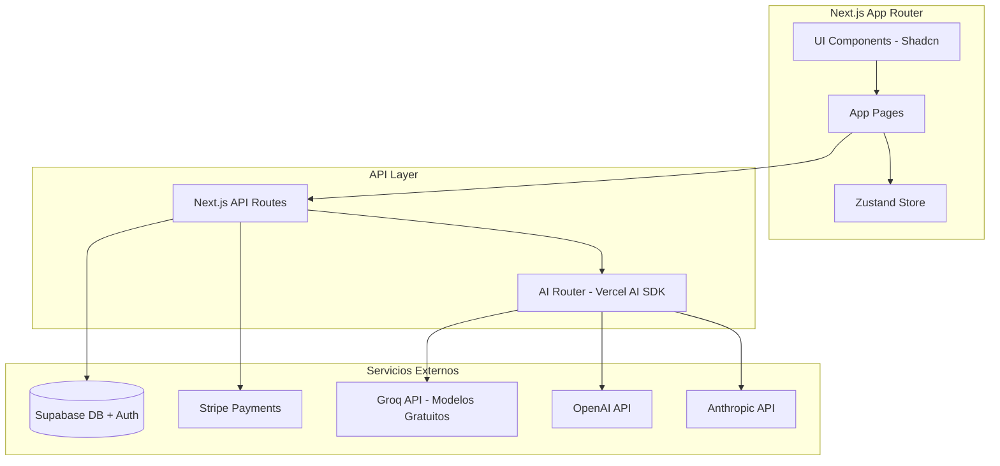
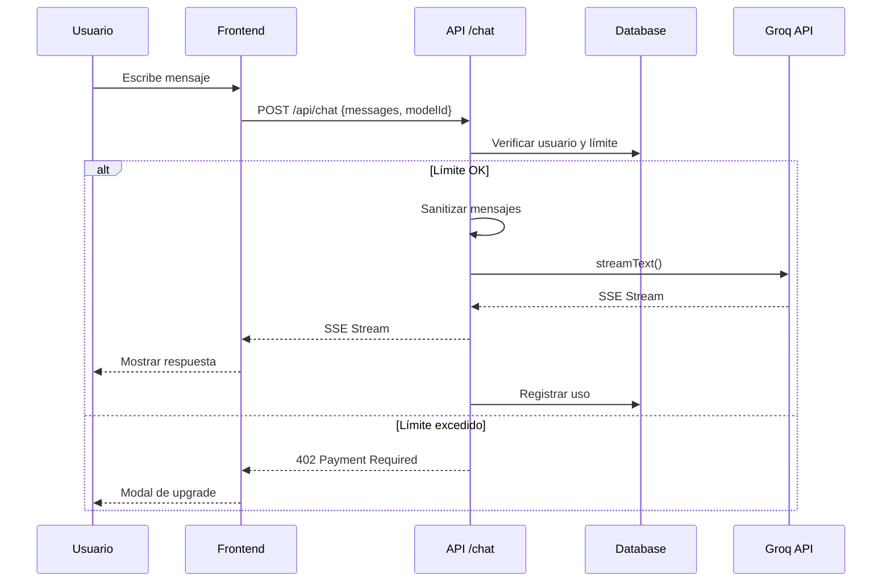
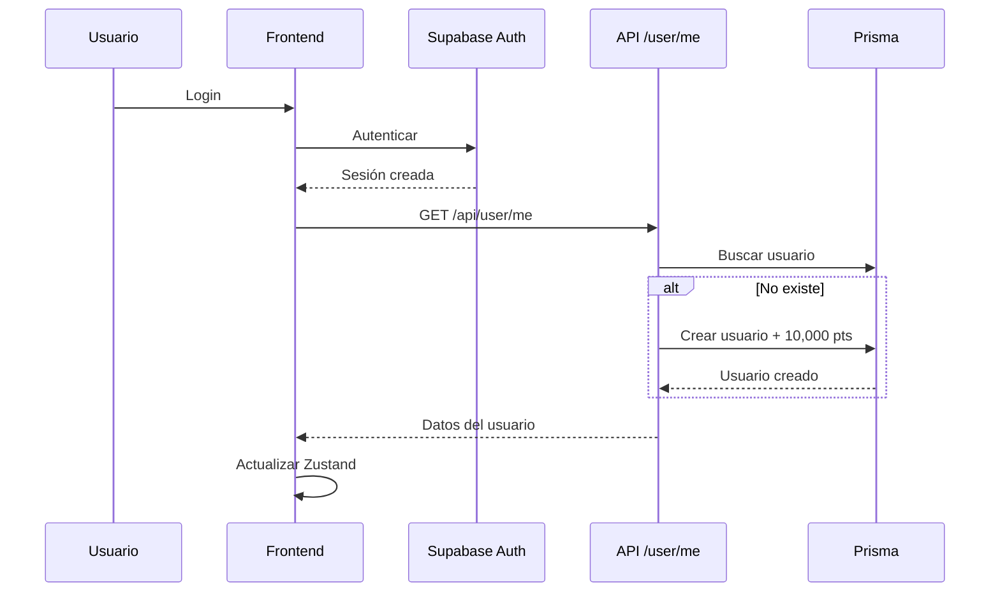

# Aether Hub - Arquitectura del Sistema

## 📋 Resumen del Proyecto

**Nombre:** Aether Hub (The Universal AI Hub)  
**Objetivo:** Plataforma SaaS que unifica múltiples APIs de modelos fundacionales bajo una única interfaz con sistema de economía de puntos.

**Stack Tecnológico:**
- **Frontend:** Next.js 14+ (App Router), React 18, Tailwind CSS, Shadcn UI
- **Estado Global:** Zustand
- **Backend:** Next.js API Routes
- **Base de Datos:** Supabase (PostgreSQL + Auth + Realtime)
- **ORM:** Prisma
- **Pagos:** Stripe API
- **IA:** Vercel AI SDK (OpenAI, Anthropic, Google, Groq)

---

## 📚 Documentación Oficial (Fuente de Verdad)

Esta carpeta contiene la documentación actualizada del proyecto. **Consultar estos documentos antes de realizar cambios:**

| Documento | Propósito | Cuándo Consultar |
|-----------|-----------|------------------|
| [`ui-design-system.md`](ui-design-system.md) | Frontend, UI/UX, Layout, Componentes | Antes de modificar cualquier componente visual |
| [`api-routes.md`](api-routes.md) | Backend, APIs, Modelos IA, Endpoints | Antes de añadir/modificar endpoints o modelos |
| [`prisma-schema.md`](prisma-schema.md) | Base de Datos, Estado, Null-Checks | Antes de modificar el esquema o estado |
| [`implementation-plan.md`](implementation-plan.md) | Plan de implementación original | Referencia histórica |

---

## 🏗️ Arquitectura General



---

## 📁 Estructura de Carpetas

```
aether-hub/
├── src/
│   ├── app/                          # Next.js App Router
│   │   ├── (auth)/                   # Rutas de autenticación
│   │   │   ├── login/
│   │   │   └── register/
│   │   ├── (dashboard)/              # Rutas protegidas
│   │   │   ├── layout.tsx            # Layout principal con sidebar
│   │   │   ├── arena-texto/          # Arena de Texto
│   │   │   ├── arena-codigo/         # Arena de Código
│   │   │   ├── arena/                # Arenas multimedia
│   │   │   │   ├── imagenes/
│   │   │   │   ├── video/
│   │   │   │   └── audio/
│   │   │   ├── pricing/
│   │   │   ├── configuracion/
│   │   │   └── historial/
│   │   ├── api/                      # API Routes
│   │   │   ├── chat/route.ts         # Endpoint principal de chat
│   │   │   ├── user/me/route.ts      # Datos de usuario
│   │   │   ├── auth/
│   │   │   └── stripe/
│   │   └── layout.tsx                # Root layout
│   ├── components/
│   │   ├── ui/                       # Componentes Shadcn UI
│   │   ├── layout/                   # Sidebar, Header
│   │   ├── chat/                     # Componentes de chat
│   │   ├── telemetry/                # Panel de telemetría
│   │   ├── pricing/                  # Modal de pricing
│   │   └── settings/                 # Modal de configuración
│   ├── lib/
│   │   ├── supabase/                 # Cliente Supabase
│   │   ├── prisma.ts                 # Cliente Prisma
│   │   ├── stripe/                   # Cliente Stripe
│   │   └── ai/                       # Configuración de IA
│   ├── stores/                       # Stores de Zustand
│   │   ├── user-store.ts
│   │   ├── chat-store.ts
│   │   └── auth-store.ts
│   ├── config/
│   │   ├── ai-models.ts              # Configuración de modelos IA
│   │   ├── skills.ts                 # Skills/asistentes
│   │   └── index.ts                  # Exports principales
│   └── types/
│       └── index.ts                  # Tipos TypeScript
├── prisma/
│   ├── schema.prisma                 # Esquema de base de datos
│   └── seed.ts                       # Datos iniciales
└── plans/                            # Documentación
    ├── aether-hub-architecture.md    # Este archivo
    ├── ui-design-system.md           # Especificación UI/UX
    ├── api-routes.md                 # Especificación APIs
    ├── prisma-schema.md              # Especificación BD/Estado
    └── implementation-plan.md        # Plan de implementación
```

---

## 🎨 Estilo Visual: Material Neon Minimalista

El diseño sigue el estilo **"Material Neon Minimalista"**:

- **Fondos oscuros** con translucidez estratégica
- **Acentos violeta tenues** (no invasivos)
- **Bordes sutiles** (`border-primary-500/10`)
- **Header ultra minimalista** (sin logo ni perfil)
- **Perfil integrado en Sidebar** (dropdown inferior)

Ver detalles completos en [`ui-design-system.md`](ui-design-system.md).

---

## 🤖 Modelos de IA Disponibles

### Modelos Gratuitos (Groq)

| ID | Nombre | Uso Recomendado |
|----|--------|-----------------|
| `llama-3.3-70b-versatile` | Llama 3.3 70B | Tareas generales potentes |
| `llama-3.1-8b-instant` | Llama 3.1 8B | Respuestas rápidas |
| `qwen/qwen3-32b` | Qwen 3 32B | Razonamiento |
| `moonshotai/kimi-k2-instruct-0905` | Kimi K2 | Razonamiento avanzado |
| `openai/gpt-oss-120b` | GPT-OSS 120B | Tareas complejas |
| `openai/gpt-oss-20b` | GPT-OSS 20B | Tareas medias |

### Modelos Premium (Deshabilitados)

Los modelos de OpenAI, Anthropic y Google están configurados pero deshabilitados hasta que el usuario proporcione su propia API key.

Ver detalles completos en [`api-routes.md`](api-routes.md).

---

## 💰 Sistema de Puntos

### Conversión

```
1 Punto = $0.001 USD
10,000 Puntos = $10.00 USD
```

### Puntos de Bienvenida

- **Nuevo usuario:** 10,000 puntos gratis
- **Límite diario por defecto:** 10,000 puntos

### Reglas Críticas

1. **Fallback 200:** `/api/user/me` NUNCA devuelve 404 para usuarios autenticados
2. **Null-Checks obligatorios:** Todo acceso a datos de usuario debe ser null-safe
3. **Sanitización de mensajes:** Siempre sanitizar antes de enviar a Groq

Ver detalles completos en [`prisma-schema.md`](prisma-schema.md).

---

## 🚀 Reglas de Oro del Desarrollo

| Regla | Descripción |
|-------|-------------|
| 🚫 **No modificar UI sin consultar** | La interfaz está aprobada por el usuario |
| ✅ **IDs de modelos exactos** | Usar los IDs exactos de [`api-routes.md`](api-routes.md) |
| ✅ **Null-checks obligatorios** | Patrones en [`prisma-schema.md`](prisma-schema.md) |
| ✅ **Sanitización de payload** | Siempre antes de `streamText()` |
| ✅ **Fallback 200** | En endpoints de usuario |

---

## 📊 Diagramas de Flujo

### Flujo de Chat



### Flujo de Autenticación



---

## 📝 Mantenimiento

### Cuándo actualizar la documentación:

1. **Nuevos modelos de IA** → Actualizar [`api-routes.md`](api-routes.md)
2. **Cambios de layout/componentes** → Actualizar [`ui-design-system.md`](ui-design-system.md)
3. **Cambios de esquema BD** → Actualizar [`prisma-schema.md`](prisma-schema.md)
4. **Nuevos endpoints** → Actualizar [`api-routes.md`](api-routes.md)

---

*Última actualización: Febrero 2026 - Auditoría Arquitectónica y Sincronización de Fuente de Verdad*
