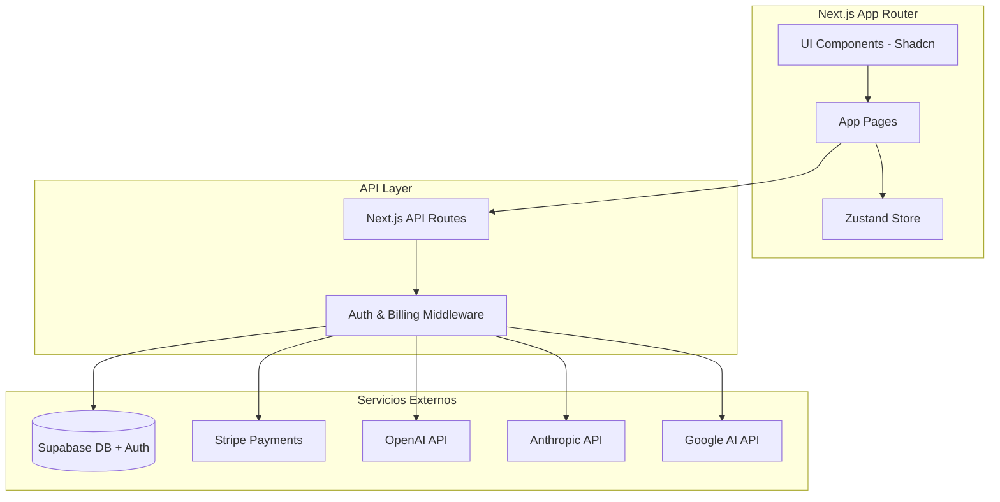
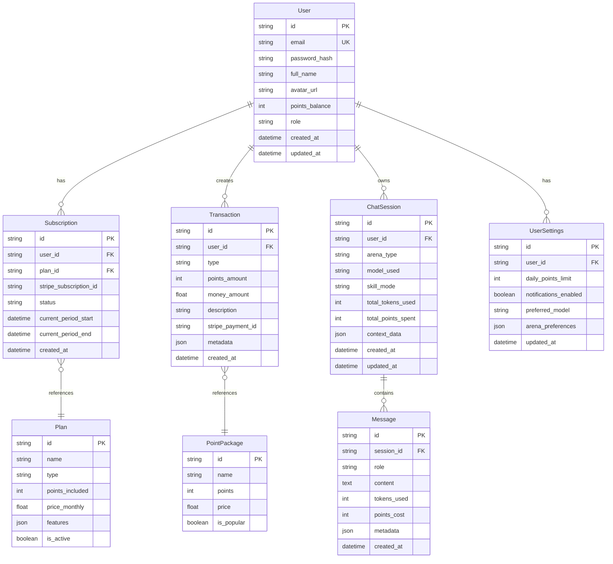
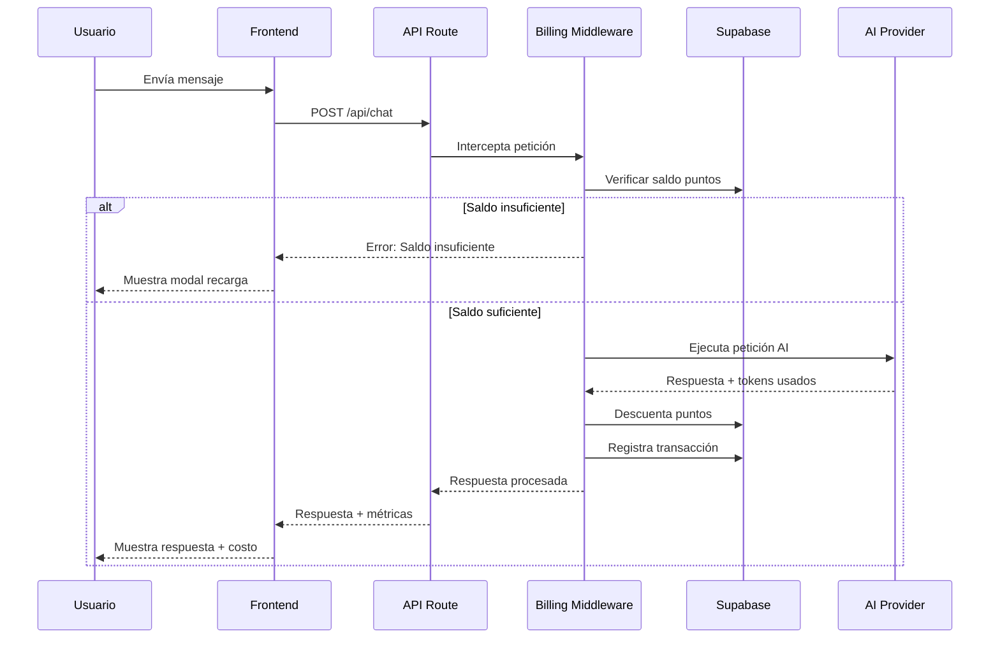

# Aether Hub - Arquitectura del Sistema

## 📋 Resumen del Proyecto

**Nombre:** Aether Hub (The Universal AI Hub)  
**Objetivo:** Plataforma SaaS que unifica múltiples APIs de modelos fundacionales bajo una única interfaz con sistema de economía de puntos.

**Stack Tecnológico:**
- **Frontend:** Next.js 14+ (App Router), React 18, Tailwind CSS, Shadcn UI
- **Estado Global:** Zustand
- **Backend:** Next.js API Routes
- **Base de Datos:** Supabase (PostgreSQL + Auth + Realtime)
- **ORM:** Prisma
- **Pagos:** Stripe API
- **IA:** OpenAI SDK compatible, LangChain (opcional)

**Paleta de Colores (Arcano-Tecnológico):**
- Primary: Violeta eléctrico (`#8B5CF6`, `#7C3AED`, `#6D28D9`)
- Background: Oscuro elegante (`#0F0F1A`, `#1A1A2E`, `#16213E`)
- Accent: Violeta brillante para highlights
- Text: Blancos y grises suaves

---

## 🏗️ Arquitectura General



---

## 📁 Estructura de Carpetas

```
aether-hub/
├── app/                          # Next.js App Router
│   ├── (auth)/                   # Grupo de rutas de autenticación
│   │   ├── login/
│   │   ├── register/
│   │   └── layout.tsx
│   ├── (dashboard)/              # Grupo de rutas protegidas
│   │   ├── layout.tsx            # Layout principal con sidebar
│   │   ├── page.tsx              # Dashboard home
│   │   ├── arena-texto/          # Arena de Texto & Documentos
│   │   ├── arena-codigo/         # Arena de Codificación
│   │   ├── arena-multimedia/     # Arena Multimedia
│   │   ├── pricing/              # Planes y configurador
│   │   ├── settings/             # Configuración de usuario
│   │   └── history/              # Historial de sesiones
│   ├── api/                      # API Routes
│   │   ├── auth/
│   │   ├── chat/
│   │   ├── billing/
│   │   ├── points/
│   │   └── models/
│   └── layout.tsx                # Root layout
├── components/
│   ├── ui/                       # Componentes Shadcn UI
│   ├── layout/                   # Sidebar, Header, Footer
│   ├── chat/                     # Componentes de chat
│   ├── arena/                    # Componentes específicos de arenas
│   ├── billing/                  # Componentes de facturación
│   └── telemetry/                # Componentes de telemetría
├── lib/
│   ├── supabase/                 # Cliente y helpers de Supabase
│   ├── stripe/                   # Cliente y helpers de Stripe
│   ├── ai/                       # Wrappers de APIs de IA
│   ├── points/                   # Lógica de puntos y costos
│   └── utils.ts                  # Utilidades generales
├── hooks/                        # Custom hooks de React
├── stores/                       # Stores de Zustand
├── types/                        # Tipos TypeScript
├── prisma/                       # Schema y migraciones
│   └── schema.prisma
├── public/
│   └── assets/
└── styles/
    └── globals.css
```

---

## 🗄️ Modelo de Datos (Prisma Schema)



---

## 💰 Sistema de Puntos y Facturación

### Conversión de Puntos

```
1 Punto = $0.001 USD (0.1 centavos)
1,000 Puntos = $1.00 USD
10,000 Puntos = $10.00 USD
```

### Costos por Modelo (Ejemplo)

| Modelo | Input (pts/1K tokens) | Output (pts/1K tokens) |
|--------|----------------------|------------------------|
| GPT-4o | 2.5 | 10.0 |
| GPT-4o-mini | 0.15 | 0.6 |
| Claude 3.5 Sonnet | 3.0 | 15.0 |
| Claude 3 Haiku | 0.25 | 1.25 |
| Gemini Pro | 0.5 | 1.5 |

### Flujo de Facturación



---

## 🎨 Sistema de Diseño

### Tokens de Diseño

```css
:root {
  /* Colores primarios - Violeta */
  --primary-50: #faf5ff;
  --primary-100: #f3e8ff;
  --primary-200: #e9d5ff;
  --primary-300: #d8b4fe;
  --primary-400: #c084fc;
  --primary-500: #a855f7;
  --primary-600: #9333ea;
  --primary-700: #7c3aed;
  --primary-800: #6b21a8;
  --primary-900: #581c87;

  /* Background oscuro */
  --bg-primary: #0f0f1a;
  --bg-secondary: #1a1a2e;
  --bg-tertiary: #16213e;
  --bg-card: #1e1e32;
  --bg-elevated: #252542;

  /* Texto */
  --text-primary: #ffffff;
  --text-secondary: #a1a1aa;
  --text-muted: #71717a;

  /* Estados */
  --success: #22c55e;
  --warning: #eab308;
  --error: #ef4444;
  --info: #3b82f6;
}
```

### Componentes UI Principales

1. **Sidebar de Navegación**
   - Logo Aether
   - Enlaces a Arenas
   - Saldo de puntos (tiempo real)
   - Perfil de usuario

2. **Header**
   - Breadcrumb de navegación
   - Selector de modelo activo
   - Notificaciones
   - Toggle de tema

3. **Context Window Bar**
   - Barra de progreso animada
   - Indicadores de color (verde/amarillo/rojo)
   - Contador de tokens

4. **Chat Interface**
   - Área de mensajes con scroll
   - Input con contador de tokens
   - Selector de Skill/Modo
   - Botón de envío con indicador de costo

---

## 🔌 API Routes

### Autenticación
- `POST /api/auth/register` - Registro de usuario
- `POST /api/auth/login` - Inicio de sesión
- `POST /api/auth/logout` - Cerrar sesión
- `GET /api/auth/session` - Obtener sesión actual

### Chat
- `POST /api/chat/completions` - Enviar mensaje
- `GET /api/chat/sessions` - Listar sesiones
- `GET /api/chat/sessions/:id` - Obtener sesión
- `DELETE /api/chat/sessions/:id` - Eliminar sesión

### Facturación
- `GET /api/billing/plans` - Obtener planes disponibles
- `POST /api/billing/subscribe` - Crear suscripción
- `POST /api/billing/checkout` - Checkout para puntos
- `POST /api/billing/webhook` - Webhook de Stripe
- `GET /api/billing/transactions` - Historial de transacciones

### Puntos
- `GET /api/points/balance` - Saldo actual
- `GET /api/points/usage` - Uso del período
- `POST /api/points/purchase` - Comprar puntos

### Modelos
- `GET /api/models` - Listar modelos disponibles
- `GET /api/models/:id/pricing` - Precios de modelo

---

## 📊 Módulos de Arena

### Arena de Texto & Documentos

**Skills/Modos disponibles:**
- `assistant` - Asistente Estándar
- `creative` - Poeta/Creativo
- `academic` - Redactor Académico
- `casual` - Tono Coloquial
- `seo` - Experto SEO
- `summarizer` - Resumidor Ejecutivo

### Arena de Codificación (Dev Hub)

**Modos disponibles:**
- `architect` - Arquitecto de Software
- `debugger` - Depurador de Errores
- `optimizer` - Optimizador de Rendimiento
- `tester` - Generador de Tests

**Características:**
- Editor Monaco integrado
- Syntax highlighting
- Detección de lenguaje automática

### Arena Multimedia

**Sub-módulos:**
- `image` - Generación de Imágenes (DALL-E, Stable Diffusion)
- `video` - Generación de Video
- `audio` - Generación de Audio

**Controles:**
- Aspect ratio slider
- Style presets
- Seed input
- Galería de resultados

---

## 🔐 Seguridad y Límites

### Hard Limits de Usuario

```typescript
interface UserLimits {
  dailyPointsLimit: number;      // Tope diario de gasto
  sessionTokensLimit: number;     // Límite de tokens por sesión
  rateLimitPerMinute: number;     // Peticiones por minuto
}
```

### Middleware de Protección

```typescript
// Pseudocódigo del middleware
async function billingMiddleware(request, user) {
  const model = request.model;
  const estimatedTokens = estimateTokens(request.messages);
  const estimatedCost = calculateCost(model, estimatedTokens);
  
  // Verificar límite diario
  const dailyUsage = await getDailyUsage(user.id);
  if (dailyUsage + estimatedCost > user.dailyLimit) {
    throw new DailyLimitExceededError();
  }
  
  // Verificar saldo
  if (user.pointsBalance < estimatedCost) {
    throw new InsufficientPointsError();
  }
  
  return { proceed: true, estimatedCost };
}
```

---

## 📈 Métricas y Telemetría

### Dashboard de Sesión

```typescript
interface SessionTelemetry {
  contextUsed: number;           // Tokens de contexto usados
  contextLimit: number;          // Límite del modelo
  contextPercentage: number;     // Porcentaje de uso
  lastRequestCost: number;       // Costo última petición
  totalSessionCost: number;      // Costo total de sesión
  currentModel: string;          // Modelo activo
  currentSkill: string;          // Skill activo
}
```

### Alertas de Contexto

| Porcentaje | Color | Acción |
|------------|-------|--------|
| 0-75% | Verde | Normal |
| 75-90% | Amarillo | Advertencia visual |
| 90-100% | Rojo | Alerta crítica + sugerencia |

---

## 🚀 Fases de Implementación

### FASE 1: Inicialización y Setup ✅
- [ ] Crear proyecto Next.js
- [ ] Configurar Tailwind CSS
- [ ] Instalar Shadcn UI
- [ ] Configurar estructura de carpetas
- [ ] Setup de Supabase
- [ ] Configurar Prisma

### FASE 2: Modelado de Datos
- [ ] Crear schema de Prisma
- [ ] Configurar migraciones
- [ ] Seed de datos iniciales
- [ ] Configurar autenticación Supabase

### FASE 3: UI/UX Core
- [ ] Layout principal dark mode
- [ ] Sidebar de navegación
- [ ] Header con saldo
- [ ] Página de dashboard

### FASE 4: Motor de Chat
- [ ] Interfaz de chat
- [ ] Barra de contexto
- [ ] Selector de modelos
- [ ] Selector de skills

### FASE 5: Sistema de Facturación
- [ ] Middleware de puntos
- [ ] Integración Stripe
- [ ] Webhooks
- [ ] Transacciones

### FASE 6: Configurador de Packs
- [ ] Página de pricing
- [ ] Configurador interactivo
- [ ] Checkout flow

---

## 📝 Notas Adicionales

- **Internacionalización:** Preparar para i18n desde el inicio
- **Accesibilidad:** Cumplir WCAG 2.1 AA
- **SEO:** Metadata dinámica por página
- **Testing:** Jest + Testing Library + Playwright
- **CI/CD:** GitHub Actions para deploy automático
