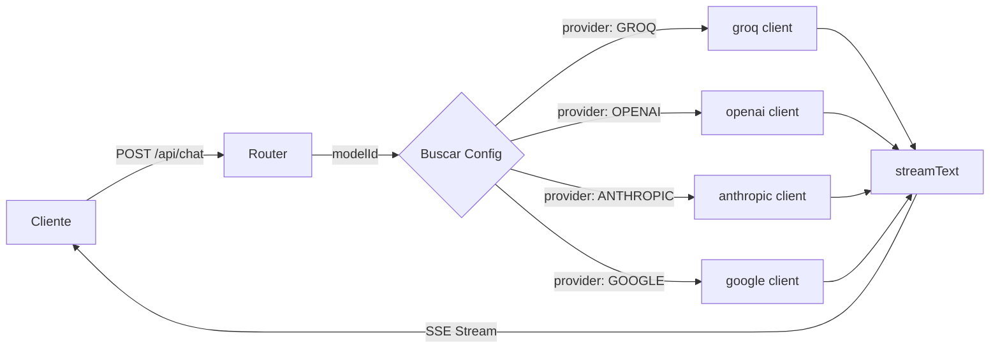
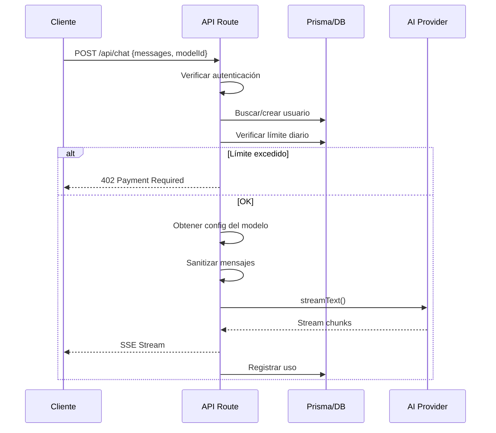

# API Routes - Aether Hub

## 📋 Resumen Ejecutivo

Este documento define la especificación oficial de las APIs de Aether Hub, sirviendo como **Fuente de Verdad** para los endpoints, integraciones de IA y lógica de negocio del backend.

**Última actualización:** Febrero 2026  
**Estado:** En producción

---

## 🏗️ Arquitectura del Motor de Inferencia

### Stack Tecnológico

El backend utiliza el **Vercel AI SDK** como capa de abstracción unificada para múltiples proveedores de IA:

```typescript
// Dependencias principales
import { createOpenAI } from '@ai-sdk/openai'
import { createAnthropic } from '@ai-sdk/anthropic'
import { createGoogleGenerativeAI } from '@ai-sdk/google'
import { streamText } from 'ai'
```

### Patrón de Diseño: Router/Enrutador

El endpoint `/api/chat/route.ts` actúa como un **Router** que:

1. Recibe la petición con `modelId`
2. Busca la configuración del modelo en `AI_MODELS`
3. Selecciona el proveedor apropiado
4. Ejecuta la petición con `streamText()`
5. Devuelve la respuesta en streaming



### Inicialización de Clientes

```typescript
// src/app/api/chat/route.ts

// OpenAI client
const openai = createOpenAI({
  apiKey: process.env.OPENAI_API_KEY,
})

// Anthropic client
const anthropic = createAnthropic({
  apiKey: process.env.ANTHROPIC_API_KEY,
})

// Google client
const google = createGoogleGenerativeAI({
  apiKey: process.env.GOOGLE_AI_API_KEY || process.env.GOOGLE_API_KEY,
})

// Groq client (OpenAI-compatible API)
const groq = createOpenAI({
  baseURL: 'https://api.groq.com/openai/v1',
  apiKey: process.env.GROQ_API_KEY,
})
```

### Función de Selección de Modelo

```typescript
function getModelInstance(modelId: string, provider: string) {
  switch (provider) {
    case 'OPENAI':
      return openai(modelId)
    case 'ANTHROPIC':
      return anthropic(modelId)
    case 'GOOGLE':
      return google(modelId)
    case 'GROQ':
      return groq(modelId)
    default:
      throw new Error(`Unsupported provider: ${provider}`)
  }
}
```

---

## 🤖 Mapeo de Modelos (Groq)

### Lista OFICIAL de Modelos Disponibles

**UBICACIÓN:** [`src/config/ai-models.ts`](../src/config/ai-models.ts)

Los siguientes modelos están configurados y **DEBEN coincidir exactamente** con los IDs de la API de Groq para evitar errores 400:

| ID Exacto | Nombre Display | Contexto | Tier | Disponible |
|-----------|----------------|----------|------|------------|
| `llama-3.3-70b-versatile` | Llama 3.3 70B Versatile | 128K | free | ✅ Sí |
| `llama-3.1-8b-instant` | Llama 3.1 8B Instant | 128K | free | ✅ Sí |
| `qwen/qwen3-32b` | Qwen 3 32B | 128K | free | ✅ Sí |
| `moonshotai/kimi-k2-instruct-0905` | Kimi K2 Instruct | 128K | free | ✅ Sí |
| `openai/gpt-oss-120b` | GPT-OSS 120B | 128K | free | ✅ Sí |
| `openai/gpt-oss-20b` | GPT-OSS 20B | 128K | free | ✅ Sí |
| `mixtral-8x7b-32768` | Mixtral 8x7B | 32K | free | ✅ Sí |
| `gemma2-9b-it` | Gemma 2 9B | 8K | free | ✅ Sí |

### Modelos Premium (Deshabilitados)

Los siguientes modelos están configurados pero **NO disponibles** actualmente (requieren API key propia):

| ID Exacto | Nombre Display | Motivo |
|-----------|----------------|--------|
| `gpt-4o` | GPT-4o | Premium - requiere API key |
| `gpt-4o-mini` | GPT-4o Mini | Premium - requiere API key |
| `claude-3-5-sonnet-20241022` | Claude 3.5 Sonnet | Premium - requiere API key |
| `claude-3-5-haiku-20241022` | Claude 3.5 Haiku | Premium - requiere API key |

### Estructura de Configuración de Modelo

```typescript
// src/config/ai-models.ts

export interface AIModelConfig {
  id: string                    // ID exacto para la API
  name: string                  // Nombre para display
  provider: AIProvider          // OPENAI | ANTHROPIC | GOOGLE | GROQ
  providerDisplayName: string   // "Groq" | "OpenAI" | etc.
  contextWindow: number         // Ventana de contexto en tokens
  maxOutputTokens: number       // Output máximo permitido
  supportsVision: boolean
  supportsFunctionCalling: boolean
  supportsJsonMode: boolean
  pricing: {
    inputPer1K: number          // Puntos por 1K tokens input
    outputPer1K: number         // Puntos por 1K tokens output
  }
  tier: 'free' | 'standard' | 'premium' | 'flagship'
  isAvailable: boolean          // CRÍTICO: false = bloqueado
  description?: string
  reasoningEffort?: 'default' | 'medium' | 'high'  // Solo Groq
}
```

---

## 🧹 Sanitización de Payload

### El Problema

Groq y otros proveedores estrictos **SOLO aceptan** mensajes con el formato:

```typescript
{ role: 'user' | 'assistant', content: string }
```

El frontend puede enviar:
- Contenido multimodal (arrays de objetos con imágenes)
- Roles no estándar (`function`, `system` en medio del chat)
- Contenido `null` o `undefined`

### La Solución: Sanitización Obligatoria

```typescript
// src/app/api/chat/route.ts

// SANITIZATION: Convert messages to clean format for AI SDK
const coreMessages = messages.map((msg: { role: string; content: unknown }) => {
  // Extract pure text from content
  let pureText = ''
  
  if (typeof msg.content === 'string') {
    pureText = msg.content
  } else if (Array.isArray(msg.content)) {
    // Handle multimodal content arrays - extract only text parts
    pureText = msg.content
      .filter((part: unknown) =>
        typeof part === 'object' && part !== null && (part as { type?: string }).type === 'text'
      )
      .map((part: unknown) => (part as { text?: string }).text || '')
      .join('\n')
  } else if (msg.content !== null && msg.content !== undefined) {
    pureText = String(msg.content)
  }

  // Normalize role - Groq doesn't accept 'function' role
  let normalizedRole = msg.role?.toLowerCase() || 'user'
  if (normalizedRole === 'function' || normalizedRole === 'system') {
    normalizedRole = 'assistant'
  }

  return {
    role: normalizedRole as 'user' | 'assistant',
    content: pureText,
  }
}).filter((msg) => msg.content.trim().length > 0) // Remove empty messages
```

### Reglas de Sanitización

| Input | Transformación | Output |
|-------|----------------|--------|
| `content: "texto"` | Sin cambios | `content: "texto"` |
| `content: [{type: "text", text: "hola"}, {type: "image", url: "..."}]` | Extraer solo texto | `content: "hola"` |
| `content: null` | String vacío | `content: ""` (filtrado) |
| `role: "function"` | Normalizar | `role: "assistant"` |

---

## 📡 Endpoints Principales

### POST /api/chat

**Ubicación:** [`src/app/api/chat/route.ts`](../src/app/api/chat/route.ts)

#### Request

```typescript
interface ChatRequest {
  messages: Array<{
    role: 'user' | 'assistant'
    content: string | Array<unknown>
  }>
  modelId: string        // REQUERIDO - ID del modelo
  skillId?: string       // OPCIONAL - ID del skill/asistente
  maxTokens?: number     // Default: 4096
  temperature?: number   // Default: 0.7
}
```

#### Response (Streaming)

El endpoint devuelve un **Server-Sent Events (SSE)** stream:

```
0:"Hola"
0:", "
0:"¿cómo"
0:" estás?"
```

#### Flujo de Ejecución



#### Manejo de Errores

| Código | Significado | Acción del Cliente |
|--------|-------------|-------------------|
| 401 | No autenticado | Redirigir a login |
| 402 | Límite diario excedido | Mostrar modal de upgrade |
| 403 | Modelo no disponible | Mostrar error, sugerir otro modelo |
| 400 | Request inválido | Mostrar error al usuario |
| 500 | Error del servidor | Mostrar error genérico |

---

### GET /api/user/me

**Ubicación:** [`src/app/api/user/me/route.ts`](../src/app/api/user/me/route.ts)

#### Propósito

Obtener los datos del usuario autenticado, incluyendo:
- Información del perfil
- Balance de puntos
- Configuración
- Suscripción activa

#### Response

```typescript
interface UserMeResponse {
  user: {
    id: string
    email: string
    fullName: string | null
    avatarUrl: string | null
    role: 'USER' | 'ADMIN' | 'MODERATOR'
    pointsBalance: number
    isActive: boolean
    createdAt: Date
  }
  subscription: {
    id: string
    status: string
    currentPeriodEnd: Date | null
    plan: {
      id: string
      name: string
      slug: string
      pointsIncluded: number
    }
  } | null
  settings: {
    dailyPointsLimit: number
    sessionTokensLimit: number
    preferredModel: string | null
    theme: string
    language: string
  } | null
  points: {
    balance: number
    dailyUsage: number
    dailyLimit: number
    remainingToday: number
  }
}
```

#### REGLA CRÍTICA: Fallback 200

Este endpoint **NUNCA debe devolver 404** para un usuario autenticado. Si el usuario no existe en Prisma, se crea automáticamente con puntos de bienvenida.

---

## 💰 Sistema de Puntos

### Constantes

```typescript
// Puntos de bienvenida para nuevos usuarios
const WELCOME_BONUS_POINTS = 10000

// Límite diario por defecto
const DEFAULT_DAILY_LIMIT = 10000
```

### Verificación de Límite Diario

```typescript
// En /api/chat/route.ts

const today = new Date()
today.setHours(0, 0, 0, 0)

const todayUsage = await prisma.transaction.aggregate({
  where: {
    userId,
    type: 'USAGE_DEDUCTION',
    createdAt: { gte: today },
  },
  _sum: { pointsAmount: true },
})

const dailyUsed = Math.abs(todayUsage._sum.pointsAmount || 0)
const dailyPointsLimit = user.settings?.dailyPointsLimit || 10000
const remainingDaily = dailyPointsLimit - dailyUsed

if (remainingDaily <= 0) {
  return new Response(JSON.stringify({
    error: 'Daily limit exceeded',
    code: 'DAILY_LIMIT_EXCEEDED',
  }), { status: 402 })
}
```

---

## 🔐 Autenticación

### Flujo de Autenticación

Aether Hub utiliza **Supabase Auth** para la autenticación:

```typescript
// src/lib/supabase/server.ts

export async function getAuthUser() {
  const supabase = createServerClient()
  const { data: { user } } = await supabase.auth.getUser()
  return user
}
```

---

## 🔧 Variables de Entorno Requeridas

```env
# Supabase
NEXT_PUBLIC_SUPABASE_URL=
NEXT_PUBLIC_SUPABASE_ANON_KEY=
SUPABASE_SERVICE_ROLE_KEY=

# Database (Prisma/PostgreSQL)
DATABASE_URL=
DIRECT_URL=

# AI Providers
GROQ_API_KEY=           # Requerido para modelos gratuitos
OPENAI_API_KEY=         # Opcional - para modelos premium
ANTHROPIC_API_KEY=      # Opcional - para modelos premium
GOOGLE_AI_API_KEY=      # Opcional - para modelos premium

# Stripe
NEXT_PUBLIC_STRIPE_PUBLISHABLE_KEY=
STRIPE_SECRET_KEY=
STRIPE_WEBHOOK_SECRET=

# App
NEXT_PUBLIC_URL=http://localhost:3000
```

---

## 🚫 Errores Comunes y Soluciones

### Error 400: Model Not Found

**Causa:** El `modelId` enviado no coincide con ningún modelo configurado.

**Solución:** Verificar que el ID sea exactamente igual al de `AI_MODELS`.

### Error 400: Invalid Messages Format

**Causa:** El array de mensajes contiene formatos no soportados.

**Solución:** La sanitización debe ejecutarse SIEMPRE antes de llamar a `streamText()`.

### Error 401: Unauthorized

**Causa:** No hay sesión de Supabase válida.

**Solución:** Verificar que el cliente envíe las cookies de sesión.

### Error 402: Daily Limit Exceeded

**Causa:** El usuario ha gastado más de su límite diario.

**Solución:** Mostrar modal de upgrade o esperar al siguiente día.

---

## 📝 Checklist de Implementación Backend

- [x] Vercel AI SDK integrado
- [x] Router de proveedores funcionando
- [x] Modelos Groq configurados con IDs exactos
- [x] Sanitización de mensajes implementada
- [x] Sistema de puntos operativo
- [x] Límite diario verificado
- [x] Transacciones registradas
- [x] Streaming SSE funcionando
- [x] Manejo de errores completo
- [x] Autenticación con Supabase
