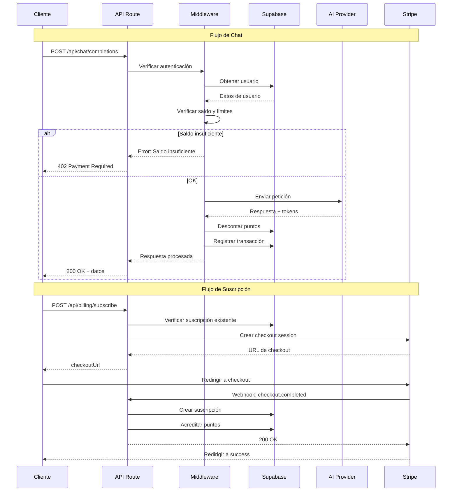

# API Routes - Aether Hub

## 📁 Estructura de API Routes

```
app/api/
├── auth/
│   ├── register/route.ts
│   ├── login/route.ts
│   ├── logout/route.ts
│   ├── session/route.ts
│   └── callback/route.ts      # OAuth callback
├── chat/
│   ├── completions/route.ts
│   ├── sessions/
│   │   ├── route.ts
│   │   └── [id]/
│   │       ├── route.ts
│   │       └── messages/route.ts
│   └── stream/route.ts
├── billing/
│   ├── plans/route.ts
│   ├── subscribe/route.ts
│   ├── checkout/route.ts
│   ├── portal/route.ts
│   └── webhook/route.ts
├── points/
│   ├── balance/route.ts
│   ├── usage/route.ts
│   └── purchase/route.ts
├── models/
│   ├── route.ts
│   └── [id]/
│       └── pricing/route.ts
├── skills/
│   └── route.ts
└── user/
    ├── route.ts
    └── settings/route.ts
```

---

## 🔐 Autenticación

### POST /api/auth/register

Registra un nuevo usuario.

**Request:**
```typescript
interface RegisterRequest {
  email: string;
  password: string;
  fullName?: string;
}
```

**Response:**
```typescript
interface AuthResponse {
  success: boolean;
  user?: {
    id: string;
    email: string;
    fullName: string | null;
  };
  session?: {
    access_token: string;
    refresh_token: string;
    expires_at: number;
  };
  error?: string;
}
```

**Código:**
```typescript
// app/api/auth/register/route.ts
import { NextRequest, NextResponse } from 'next/server';
import { createClient } from '@supabase/supabase-js';
import { prisma } from '@/lib/prisma';

const supabase = createClient(
  process.env.NEXT_PUBLIC_SUPABASE_URL!,
  process.env.SUPABASE_SERVICE_ROLE_KEY!
);

export async function POST(request: NextRequest) {
  try {
    const { email, password, fullName } = await request.json();

    // Validar input
    if (!email || !password) {
      return NextResponse.json(
        { success: false, error: 'Email y contraseña requeridos' },
        { status: 400 }
      );
    }

    // Crear usuario en Supabase Auth
    const { data: authData, error: authError } = await supabase.auth.signUp({
      email,
      password,
      options: {
        data: { full_name: fullName }
      }
    });

    if (authError) {
      return NextResponse.json(
        { success: false, error: authError.message },
        { status: 400 }
      );
    }

    // Crear usuario en la base de datos
    const user = await prisma.user.create({
      data: {
        id: authData.user!.id,
        email,
        fullName,
        pointsBalance: 1000, // Puntos de bienvenida
        settings: {
          create: {
            dailyPointsLimit: 10000,
            theme: 'dark',
            language: 'es'
          }
        }
      }
    });

    // Registrar transacción de bonificación
    await prisma.transaction.create({
      data: {
        userId: user.id,
        type: 'BONUS',
        pointsAmount: 1000,
        description: 'Puntos de bienvenida'
      }
    });

    return NextResponse.json({
      success: true,
      user: {
        id: user.id,
        email: user.email,
        fullName: user.fullName
      },
      session: authData.session
    });
  } catch (error) {
    console.error('Register error:', error);
    return NextResponse.json(
      { success: false, error: 'Error interno del servidor' },
      { status: 500 }
    );
  }
}
```

### POST /api/auth/login

Inicia sesión.

**Request:**
```typescript
interface LoginRequest {
  email: string;
  password: string;
}
```

**Response:** Mismo formato que register.

### POST /api/auth/logout

Cierra la sesión actual.

**Response:**
```typescript
interface LogoutResponse {
  success: boolean;
}
```

### GET /api/auth/session

Obtiene la sesión actual del usuario.

**Response:**
```typescript
interface SessionResponse {
  authenticated: boolean;
  user?: {
    id: string;
    email: string;
    fullName: string | null;
    avatarUrl: string | null;
    role: string;
    pointsBalance: number;
  };
  subscription?: {
    plan: string;
    status: string;
    pointsIncluded: number;
  };
}
```

---

## 💬 Chat

### POST /api/chat/completions

Envía un mensaje y obtiene una respuesta del modelo de IA.

**Request:**
```typescript
interface ChatCompletionRequest {
  messages: Array<{
    role: 'user' | 'assistant' | 'system';
    content: string;
  }>;
  model: string;           // slug del modelo
  sessionId?: string;      // ID de sesión existente
  skill?: string;          // slug del skill
  stream?: boolean;
  maxTokens?: number;
  temperature?: number;
}
```

**Response:**
```typescript
interface ChatCompletionResponse {
  success: boolean;
  id: string;              // ID del mensaje
  sessionId: string;
  message: {
    role: 'assistant';
    content: string;
  };
  usage: {
    promptTokens: number;
    completionTokens: number;
    totalTokens: number;
  };
  cost: {
    points: number;
    usd: number;
  };
  telemetry: {
    contextUsed: number;
    contextLimit: number;
    contextPercentage: number;
    contextStatus: 'normal' | 'warning' | 'critical';
  };
  error?: string;
}
```

**Código:**
```typescript
// app/api/chat/completions/route.ts
import { NextRequest, NextResponse } from 'next/server';
import { getServerSession } from '@/lib/auth';
import { prisma } from '@/lib/prisma';
import { AIProviderFactory } from '@/lib/ai/providers';
import { PointsCalculator } from '@/lib/points/calculator';
import { BillingMiddleware } from '@/lib/billing/middleware';

export async function POST(request: NextRequest) {
  try {
    const session = await getServerSession();
    if (!session) {
      return NextResponse.json(
        { success: false, error: 'No autenticado' },
        { status: 401 }
      );
    }

    const body = await request.json();
    const { messages, model: modelSlug, sessionId, skill, stream, maxTokens, temperature } = body;

    // Obtener modelo
    const model = await prisma.aIModel.findUnique({
      where: { slug: modelSlug }
    });

    if (!model || !model.isActive) {
      return NextResponse.json(
        { success: false, error: 'Modelo no disponible' },
        { status: 400 }
      );
    }

    // Obtener skill si se especifica
    let systemPrompt = '';
    if (skill) {
      const skillData = await prisma.skill.findUnique({
        where: { slug: skill }
      });
      if (skillData) {
        systemPrompt = skillData.systemPrompt;
      }
    }

    // Preparar mensajes con system prompt
    const fullMessages = systemPrompt
      ? [{ role: 'system' as const, content: systemPrompt }, ...messages]
      : messages;

    // Estimar tokens
    const estimatedTokens = PointsCalculator.estimateTokens(fullMessages, model);
    const estimatedCost = PointsCalculator.calculateCost(
      estimatedTokens.promptTokens,
      estimatedTokens.estimatedCompletion,
      model
    );

    // Verificar saldo y límites
    const billingCheck = await BillingMiddleware.verifyUserCanProceed(
      session.user.id,
      estimatedCost.points
    );

    if (!billingCheck.canProceed) {
      return NextResponse.json(
        {
          success: false,
          error: billingCheck.reason,
          code: billingCheck.code
        },
        { status: 402 }
      );
    }

    // Crear o obtener sesión
    let chatSession = sessionId;
    if (!chatSession) {
      const newSession = await prisma.chatSession.create({
        data: {
          userId: session.user.id,
          arenaType: 'TEXT',
          modelUsed: modelSlug,
          skillMode: skill,
          systemPrompt
        }
      });
      chatSession = newSession.id;
    }

    // Llamar al proveedor de IA
    const provider = AIProviderFactory.getProvider(model.provider);
    const response = await provider.chat({
      model: model.slug,
      messages: fullMessages,
      maxTokens: maxTokens || 4096,
      temperature: temperature || 0.7,
      stream: false
    });

    // Calcular costo real
    const actualCost = PointsCalculator.calculateCost(
      response.usage.promptTokens,
      response.usage.completionTokens,
      model
    );

    // Registrar uso y descontar puntos
    await BillingMiddleware.recordUsage({
      userId: session.user.id,
      sessionId: chatSession,
      model: modelSlug,
      promptTokens: response.usage.promptTokens,
      completionTokens: response.usage.completionTokens,
      pointsCost: actualCost.points,
      userMessage: messages[messages.length - 1].content,
      assistantMessage: response.message.content
    });

    // Calcular telemetría de contexto
    const contextTokens = response.usage.promptTokens;
    const contextPercentage = (contextTokens / model.contextWindow) * 100;
    const contextStatus = 
      contextPercentage > 90 ? 'critical' :
      contextPercentage > 75 ? 'warning' : 'normal';

    return NextResponse.json({
      success: true,
      id: response.id,
      sessionId: chatSession,
      message: response.message,
      usage: response.usage,
      cost: actualCost,
      telemetry: {
        contextUsed: contextTokens,
        contextLimit: model.contextWindow,
        contextPercentage: Math.round(contextPercentage),
        contextStatus
      }
    });
  } catch (error) {
    console.error('Chat completion error:', error);
    return NextResponse.json(
      { success: false, error: 'Error procesando la solicitud' },
      { status: 500 }
    );
  }
}
```

### GET /api/chat/sessions

Lista las sesiones de chat del usuario.

**Query Parameters:**
- `arenaType` (opcional): Filtrar por tipo de arena
- `page` (default: 1): Página
- `limit` (default: 20): Elementos por página

**Response:**
```typescript
interface SessionsListResponse {
  success: boolean;
  sessions: Array<{
    id: string;
    title: string | null;
    arenaType: string;
    modelUsed: string;
    totalMessages: number;
    totalPointsSpent: number;
    createdAt: string;
    updatedAt: string;
  }>;
  pagination: {
    page: number;
    limit: number;
    total: number;
    totalPages: number;
  };
}
```

### GET /api/chat/sessions/[id]

Obtiene una sesión específica con sus mensajes.

**Response:**
```typescript
interface SessionDetailResponse {
  success: boolean;
  session: {
    id: string;
    title: string | null;
    arenaType: string;
    modelUsed: string;
    skillMode: string | null;
    totalTokensUsed: number;
    totalPointsSpent: number;
    createdAt: string;
    messages: Array<{
      id: string;
      role: string;
      content: string;
      tokensUsed: number;
      pointsCost: number;
      createdAt: string;
    }>;
  };
}
```

### DELETE /api/chat/sessions/[id]

Elimina una sesión y todos sus mensajes.

**Response:**
```typescript
interface DeleteSessionResponse {
  success: boolean;
}
```

---

## 💳 Facturación

### GET /api/billing/plans

Obtiene todos los planes disponibles.

**Response:**
```typescript
interface PlansResponse {
  success: boolean;
  plans: Array<{
    id: string;
    name: string;
    slug: string;
    type: string;
    priceMonthly: number;
    priceYearly: number | null;
    pointsIncluded: number;
    features: string[];
    isPopular: boolean;
  }>;
}
```

### POST /api/billing/subscribe

Crea una suscripción para el usuario.

**Request:**
```typescript
interface SubscribeRequest {
  planId: string;
  billingCycle: 'monthly' | 'yearly';
  paymentMethodId?: string;  // Para Stripe
}
```

**Response:**
```typescript
interface SubscribeResponse {
  success: boolean;
  subscription?: {
    id: string;
    status: string;
    currentPeriodEnd: string;
  };
  checkoutUrl?: string;  // URL de Stripe Checkout si se requiere pago
  error?: string;
}
```

**Código:**
```typescript
// app/api/billing/subscribe/route.ts
import { NextRequest, NextResponse } from 'next/server';
import { getServerSession } from '@/lib/auth';
import { prisma } from '@/lib/prisma';
import { stripe } from '@/lib/stripe';

export async function POST(request: NextRequest) {
  try {
    const session = await getServerSession();
    if (!session) {
      return NextResponse.json(
        { success: false, error: 'No autenticado' },
        { status: 401 }
      );
    }

    const { planId, billingCycle, paymentMethodId } = await request.json();

    // Obtener plan
    const plan = await prisma.plan.findUnique({
      where: { id: planId }
    });

    if (!plan) {
      return NextResponse.json(
        { success: false, error: 'Plan no encontrado' },
        { status: 404 }
      );
    }

    const price = billingCycle === 'yearly' 
      ? (plan.priceYearly || plan.priceMonthly * 12)
      : plan.priceMonthly;

    // Verificar si ya tiene suscripción activa
    const existingSubscription = await prisma.subscription.findUnique({
      where: { userId: session.user.id }
    });

    if (existingSubscription && existingSubscription.status === 'ACTIVE') {
      return NextResponse.json(
        { success: false, error: 'Ya tienes una suscripción activa' },
        { status: 400 }
      );
    }

    // Crear o obtener cliente de Stripe
    let stripeCustomerId = existingSubscription?.stripeCustomerId;
    
    if (!stripeCustomerId) {
      const customer = await stripe.customers.create({
        email: session.user.email,
        metadata: {
          userId: session.user.id
        }
      });
      stripeCustomerId = customer.id;
    }

    // Crear sesión de checkout
    const checkoutSession = await stripe.checkout.sessions.create({
      customer: stripeCustomerId,
      mode: 'subscription',
      payment_method_types: ['card'],
      line_items: [{
        price_data: {
          currency: 'eur',
          product_data: {
            name: `Plan ${plan.name}`,
            description: `${plan.pointsIncluded.toLocaleString()} puntos incluidos`
          },
          unit_amount: Math.round(price * 100),
          recurring: {
            interval: billingCycle === 'yearly' ? 'year' : 'month'
          }
        },
        quantity: 1
      }],
      success_url: `${process.env.NEXT_PUBLIC_URL}/dashboard?subscription=success`,
      cancel_url: `${process.env.NEXT_PUBLIC_URL}/pricing?subscription=cancelled`,
      metadata: {
        planId: plan.id,
        userId: session.user.id,
        pointsIncluded: plan.pointsIncluded.toString()
      }
    });

    return NextResponse.json({
      success: true,
      checkoutUrl: checkoutSession.url
    });
  } catch (error) {
    console.error('Subscribe error:', error);
    return NextResponse.json(
      { success: false, error: 'Error procesando la suscripción' },
      { status: 500 }
    );
  }
}
```

### POST /api/billing/checkout

Crea una sesión de checkout para comprar puntos.

**Request:**
```typescript
interface CheckoutRequest {
  packageId: string;
}
```

**Response:**
```typescript
interface CheckoutResponse {
  success: boolean;
  checkoutUrl?: string;
  error?: string;
}
```

### POST /api/billing/webhook

Maneja webhooks de Stripe.

**Eventos manejados:**
- `checkout.session.completed` - Pago completado
- `customer.subscription.created` - Suscripción creada
- `customer.subscription.updated` - Suscripción actualizada
- `customer.subscription.deleted` - Suscripción cancelada
- `invoice.payment_succeeded` - Pago de factura exitoso
- `invoice.payment_failed` - Pago de factura fallido

**Código:**
```typescript
// app/api/billing/webhook/route.ts
import { NextRequest, NextResponse } from 'next/server';
import { headers } from 'next/headers';
import { stripe } from '@/lib/stripe';
import { prisma } from '@/lib/prisma';

export async function POST(request: NextRequest) {
  const body = await request.text();
  const signature = headers().get('stripe-signature')!;

  let event;
  try {
    event = stripe.webhooks.constructEvent(
      body,
      signature,
      process.env.STRIPE_WEBHOOK_SECRET!
    );
  } catch (err) {
    console.error('Webhook signature verification failed:', err);
    return NextResponse.json({ error: 'Invalid signature' }, { status: 400 });
  }

  try {
    switch (event.type) {
      case 'checkout.session.completed': {
        const session = event.data.object;
        const metadata = session.metadata!;
        
        if (session.mode === 'subscription') {
          // Suscripción completada
          await prisma.subscription.upsert({
            where: { userId: metadata.userId },
            create: {
              userId: metadata.userId,
              planId: metadata.planId,
              stripeSubscriptionId: session.subscription as string,
              stripeCustomerId: session.customer as string,
              status: 'ACTIVE',
              currentPeriodStart: new Date(),
              currentPeriodEnd: new Date(Date.now() + 30 * 24 * 60 * 60 * 1000)
            },
            update: {
              status: 'ACTIVE',
              stripeSubscriptionId: session.subscription as string
            }
          });

          // Acreditar puntos
          await prisma.user.update({
            where: { id: metadata.userId },
            data: {
              pointsBalance: { increment: parseInt(metadata.pointsIncluded) }
            }
          });

          await prisma.transaction.create({
            data: {
              userId: metadata.userId,
              type: 'SUBSCRIPTION_CREDIT',
              pointsAmount: parseInt(metadata.pointsIncluded),
              description: 'Crédito de suscripción',
              stripePaymentId: session.payment_intent as string
            }
          });
        } else {
          // Compra de puntos
          const purchase = await prisma.pointPurchase.findFirst({
            where: { stripePaymentId: session.payment_intent as string }
          });

          if (purchase) {
            await prisma.user.update({
              where: { id: purchase.userId },
              data: {
                pointsBalance: { increment: purchase.pointsPurchased }
              }
            });

            await prisma.transaction.create({
              data: {
                userId: purchase.userId,
                type: 'PURCHASE_POINTS',
                pointsAmount: purchase.pointsPurchased,
                moneyAmount: purchase.amountPaid,
                description: 'Compra de puntos',
                stripePaymentId: session.payment_intent as string
              }
            });
          }
        }
        break;
      }

      case 'customer.subscription.deleted': {
        const subscription = event.data.object;
        await prisma.subscription.updateMany({
          where: { stripeSubscriptionId: subscription.id },
          data: { status: 'CANCELLED' }
        });
        break;
      }

      case 'invoice.payment_failed': {
        const invoice = event.data.object;
        await prisma.subscription.updateMany({
          where: { stripeSubscriptionId: invoice.subscription as string },
          data: { status: 'PAST_DUE' }
        });
        break;
      }
    }

    return NextResponse.json({ received: true });
  } catch (error) {
    console.error('Webhook handler error:', error);
    return NextResponse.json({ error: 'Handler error' }, { status: 500 });
  }
}
```

---

## 🪙 Puntos

### GET /api/points/balance

Obtiene el saldo de puntos del usuario.

**Response:**
```typescript
interface PointsBalanceResponse {
  success: boolean;
  balance: number;
  dailyUsage: number;
  dailyLimit: number;
  remainingToday: number;
  subscription?: {
    plan: string;
    pointsIncluded: number;
    renewalDate: string | null;
  };
}
```

### GET /api/points/usage

Obtiene el historial de uso de puntos.

**Query Parameters:**
- `startDate`: Fecha inicio (ISO string)
- `endDate`: Fecha fin (ISO string)
- `page`: Página
- `limit`: Elementos por página

**Response:**
```typescript
interface PointsUsageResponse {
  success: boolean;
  summary: {
    totalUsed: number;
    totalPurchased: number;
    totalFromSubscription: number;
    averageDaily: number;
  };
  transactions: Array<{
    id: string;
    type: string;
    pointsAmount: number;
    description: string;
    createdAt: string;
  }>;
  pagination: {
    page: number;
    limit: number;
    total: number;
  };
}
```

### POST /api/points/purchase

Inicia la compra de un paquete de puntos.

**Request:**
```typescript
interface PurchasePointsRequest {
  packageId: string;
}
```

**Response:**
```typescript
interface PurchasePointsResponse {
  success: boolean;
  checkoutUrl?: string;
  error?: string;
}
```

---

## 🤖 Modelos

### GET /api/models

Lista todos los modelos de IA disponibles.

**Query Parameters:**
- `arenaType` (opcional): Filtrar por tipo de arena
- `provider` (opcional): Filtrar por proveedor

**Response:**
```typescript
interface ModelsResponse {
  success: boolean;
  models: Array<{
    id: string;
    name: string;
    slug: string;
    provider: string;
    contextWindow: number;
    inputPoints1K: number;
    outputPoints1K: number;
    capabilities: {
      chat: boolean;
      code: boolean;
      image: boolean;
      video: boolean;
      audio: boolean;
    };
  }>;
  groupedByProvider: Record<string, typeof models>;
}
```

### GET /api/models/[id]/pricing

Obtiene los precios detallados de un modelo.

**Response:**
```typescript
interface ModelPricingResponse {
  success: boolean;
  model: {
    name: string;
    provider: string;
    pricing: {
      inputPer1K: number;    // USD
      outputPer1K: number;   // USD
      inputPoints1K: number;
      outputPoints1K: number;
    };
    contextWindow: number;
    exampleCosts: Array<{
      scenario: string;
      tokens: number;
      costUSD: number;
      costPoints: number;
    }>;
  };
}
```

---

## 🎯 Skills

### GET /api/skills

Lista todos los skills disponibles.

**Query Parameters:**
- `arenaType` (opcional): Filtrar por tipo de arena

**Response:**
```typescript
interface SkillsResponse {
  success: boolean;
  skills: Array<{
    id: string;
    name: string;
    slug: string;
    arenaType: string;
    description: string | null;
    icon: string | null;
  }>;
  groupedByArena: Record<string, typeof skills>;
}
```

---

## 👤 Usuario

### GET /api/user

Obtiene el perfil del usuario actual.

**Response:**
```typescript
interface UserProfileResponse {
  success: boolean;
  user: {
    id: string;
    email: string;
    fullName: string | null;
    avatarUrl: string | null;
    role: string;
    pointsBalance: number;
    createdAt: string;
    subscription?: {
      plan: string;
      status: string;
    };
    settings: {
      dailyPointsLimit: number;
      preferredModel: string | null;
      theme: string;
      language: string;
    };
  };
}
```

### PATCH /api/user

Actualiza el perfil del usuario.

**Request:**
```typescript
interface UpdateUserRequest {
  fullName?: string;
  avatarUrl?: string;
}
```

### PATCH /api/user/settings

Actualiza la configuración del usuario.

**Request:**
```typescript
interface UpdateSettingsRequest {
  dailyPointsLimit?: number;
  preferredModel?: string;
  theme?: 'dark' | 'light' | 'system';
  language?: string;
  notificationsEmail?: boolean;
  notificationsPush?: boolean;
}
```

---

## 🔧 Middleware de Autenticación

```typescript
// lib/auth.ts
import { createServerClient } from '@supabase/ssr';
import { cookies } from 'next/headers';

export async function getServerSession() {
  const cookieStore = cookies();
  
  const supabase = createServerClient(
    process.env.NEXT_PUBLIC_SUPABASE_URL!,
    process.env.NEXT_PUBLIC_SUPABASE_ANON_KEY!,
    {
      cookies: {
        get(name: string) {
          return cookieStore.get(name)?.value;
        },
        set(name: string, value: string, options: any) {
          cookieStore.set({ name, value, ...options });
        },
        remove(name: string, options: any) {
          cookieStore.set({ name, value: '', ...options });
        },
      },
    }
  );

  const { data: { session } } = await supabase.auth.getSession();
  
  if (!session) return null;

  return {
    user: {
      id: session.user.id,
      email: session.user.email!,
    },
    accessToken: session.access_token,
  };
}
```

---

## 📊 Diagrama de Flujo de API



---

## 🚦 Códigos de Error

| Código | Descripción |
|--------|-------------|
| `UNAUTHORIZED` | No autenticado |
| `FORBIDDEN` | Sin permisos |
| `INSUFFICIENT_POINTS` | Saldo de puntos insuficiente |
| `DAILY_LIMIT_EXCEEDED` | Límite diario alcanzado |
| `MODEL_NOT_AVAILABLE` | Modelo no disponible |
| `SUBSCRIPTION_ACTIVE` | Ya tiene suscripción activa |
| `INVALID_REQUEST` | Solicitud inválida |
| `INTERNAL_ERROR` | Error interno del servidor |

---

## 📝 Notas de Implementación

1. **Rate Limiting**: Implementar con Redis o Upstash para limitar peticiones por minuto
2. **Caching**: Usar Redis para cachear modelos, skills y planes
3. **Streaming**: Implementar SSE para respuestas streaming de chat
4. **Webhooks**: Verificar siempre la firma de Stripe
5. **Logs**: Registrar todas las transacciones y errores críticos
