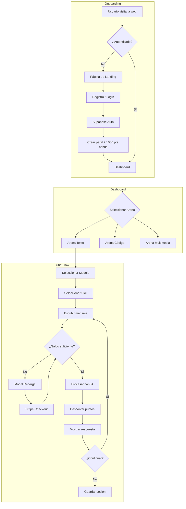
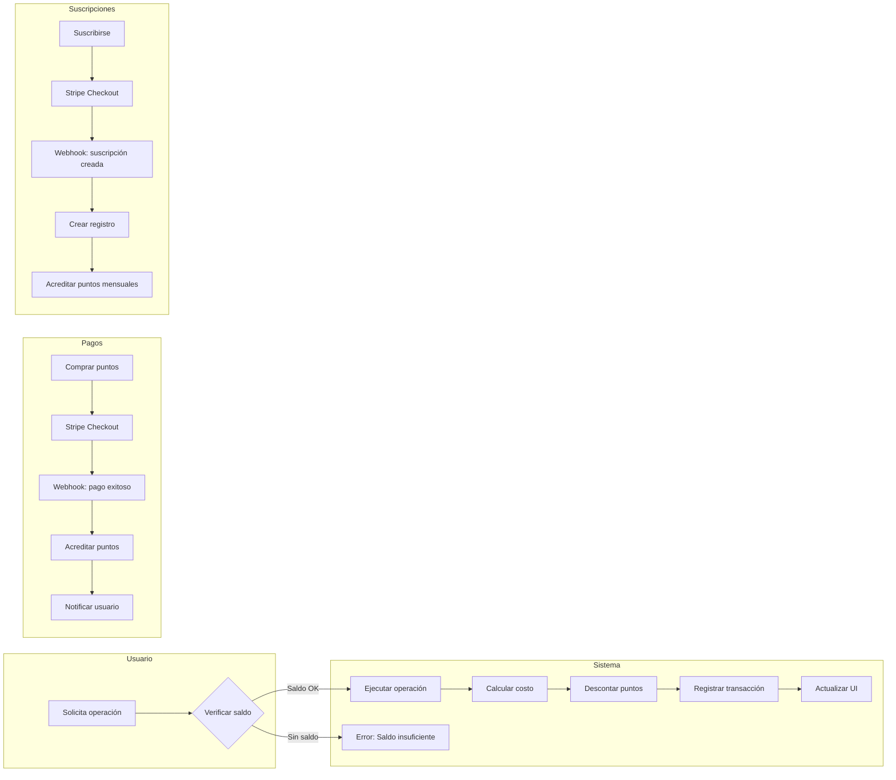
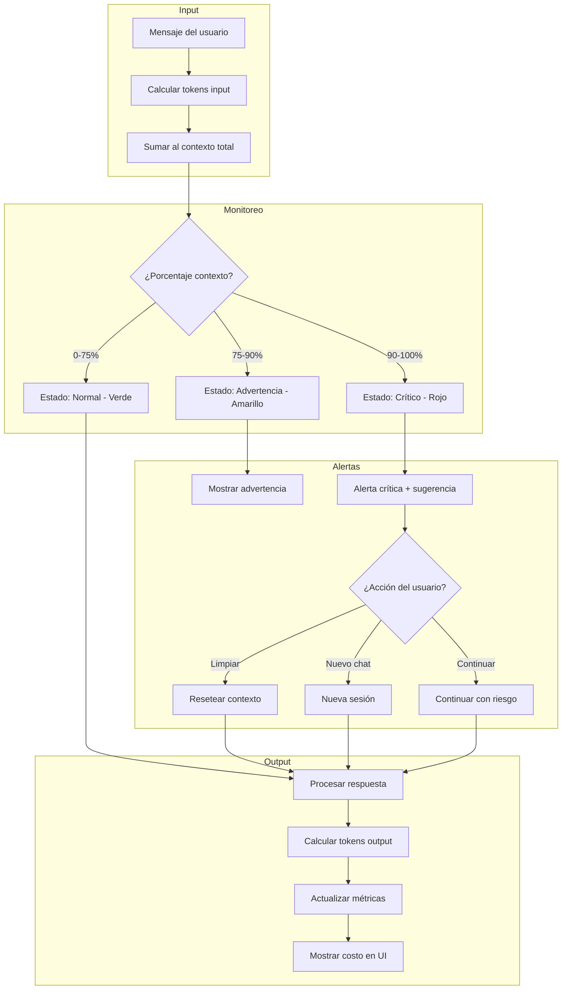
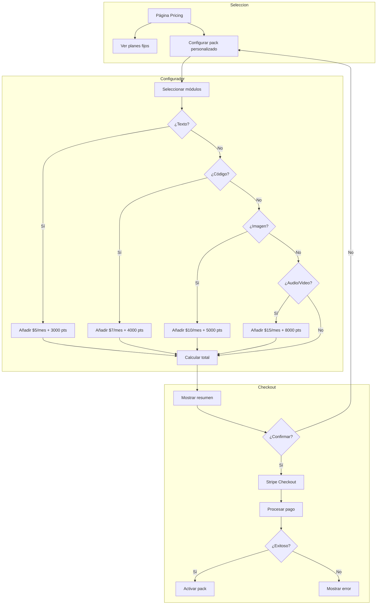
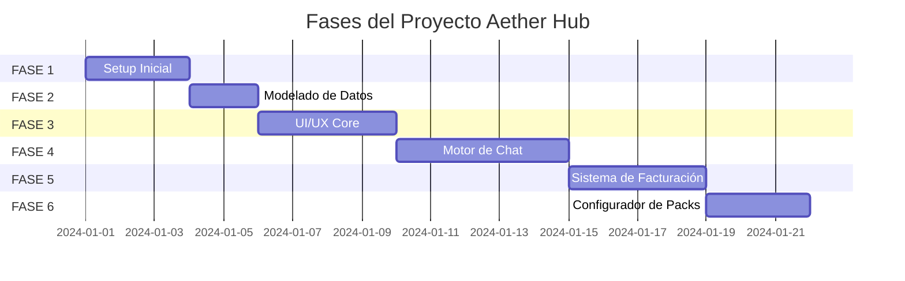

# Plan de Implementación - Aether Hub

## 📋 Resumen Ejecutivo

Este documento detalla el plan de implementación paso a paso para el proyecto Aether Hub, organizado en 6 fases secuenciales.

---

## 🔄 Diagramas de Flujo del Sistema

### Flujo General de la Aplicación



### Flujo de Facturación y Puntos



### Flujo de Contexto y Telemetría



### Flujo del Configurador de Packs



---

## 📦 FASE 1: Inicialización y Setup

### Objetivo
Crear la estructura base del proyecto Next.js con todas las configuraciones necesarias.

### Tareas Detalladas

#### 1.1 Crear proyecto Next.js
```bash
npx create-next-app@latest aether-hub --typescript --tailwind --eslint --app --src-dir --import-alias "@/*"
```

#### 1.2 Instalar dependencias base
```bash
# Dependencias de producción
npm install @supabase/supabase-js @supabase/ssr
npm install @prisma/client
npm install stripe
npm install zustand
npm install clsx tailwind-merge class-variance-authority
npm install lucide-react
npm install @radix-ui/react-slot @radix-ui/react-dialog @radix-ui/react-dropdown-menu @radix-ui/react-select @radix-ui/react-tabs @radix-ui/react-tooltip @radix-ui/react-progress
npm install react-hot-toast
npm install date-fns

# Dependencias de desarrollo
npm install -D prisma
npm install -D @types/node
npm install -D tailwindcss-animate
```

#### 1.3 Configurar Shadcn UI
```bash
npx shadcn@latest init
npx shadcn@latest add button card input select tabs dialog dropdown-menu progress avatar badge separator skeleton tooltip
```

#### 1.4 Estructura de carpetas a crear
```
aether-hub/
├── app/
│   ├── (auth)/
│   │   ├── login/page.tsx
│   │   ├── register/page.tsx
│   │   └── layout.tsx
│   ├── (dashboard)/
│   │   ├── layout.tsx
│   │   ├── page.tsx
│   │   ├── arena-texto/
│   │   ├── arena-codigo/
│   │   ├── arena-multimedia/
│   │   ├── pricing/
│   │   ├── settings/
│   │   └── history/
│   ├── api/
│   │   ├── auth/
│   │   ├── chat/
│   │   ├── billing/
│   │   ├── points/
│   │   ├── models/
│   │   └── user/
│   ├── layout.tsx
│   └── globals.css
├── components/
│   ├── ui/
│   ├── layout/
│   ├── chat/
│   ├── arena/
│   ├── billing/
│   └── telemetry/
├── lib/
│   ├── supabase/
│   ├── stripe/
│   ├── ai/
│   ├── points/
│   ├── auth.ts
│   └── utils.ts
├── hooks/
├── stores/
├── types/
├── prisma/
│   └── schema.prisma
└── public/
```

#### 1.5 Archivos de configuración

**tailwind.config.ts**
```typescript
import type { Config } from 'tailwindcss';

const config: Config = {
  darkMode: ['class'],
  content: [
    './src/pages/**/*.{js,ts,jsx,tsx,mdx}',
    './src/components/**/*.{js,ts,jsx,tsx,mdx}',
    './src/app/**/*.{js,ts,jsx,tsx,mdx}',
  ],
  theme: {
    extend: {
      colors: {
        primary: {
          50: '#faf5ff',
          100: '#f3e8ff',
          200: '#e9d5ff',
          300: '#d8b4fe',
          400: '#c084fc',
          500: '#a855f7',
          600: '#9333ea',
          700: '#7c3aed',
          800: '#6b21a8',
          900: '#581c87',
          950: '#3b0764',
        },
        background: {
          DEFAULT: '#0a0a0f',
          secondary: '#0f0f1a',
          tertiary: '#1a1a2e',
          elevated: '#252542',
        },
      },
      fontFamily: {
        sans: ['Inter', 'system-ui', 'sans-serif'],
        mono: ['JetBrains Mono', 'Consolas', 'monospace'],
      },
    },
  },
  plugins: [require('tailwindcss-animate')],
};

export default config;
```

**Variables de entorno (.env.local)**
```env
# Supabase
NEXT_PUBLIC_SUPABASE_URL=
NEXT_PUBLIC_SUPABASE_ANON_KEY=
SUPABASE_SERVICE_ROLE_KEY=

# Stripe
NEXT_PUBLIC_STRIPE_PUBLISHABLE_KEY=
STRIPE_SECRET_KEY=
STRIPE_WEBHOOK_SECRET=

# App
NEXT_PUBLIC_URL=http://localhost:3000

# AI Providers
OPENAI_API_KEY=
ANTHROPIC_API_KEY=
GOOGLE_AI_API_KEY=

# Database
DATABASE_URL=
```

### Checklist FASE 1
- [ ] Crear proyecto Next.js
- [ ] Instalar todas las dependencias
- [ ] Configurar Shadcn UI
- [ ] Crear estructura de carpetas
- [ ] Configurar Tailwind con colores personalizados
- [ ] Crear archivo de variables de entorno
- [ ] Configurar ESLint y Prettier
- [ ] Verificar que el proyecto compila correctamente

---

## 🗄️ FASE 2: Modelado de Datos

### Objetivo
Implementar el schema de Prisma y configurar la conexión con Supabase.

### Tareas Detalladas

#### 2.1 Configurar Prisma
```bash
npx prisma init
```

#### 2.2 Crear schema completo
Ver archivo [`plans/prisma-schema.md`](prisma-schema.md) para el schema completo.

#### 2.3 Configurar Supabase
1. Crear proyecto en Supabase
2. Obtener URL y keys
3. Configurar autenticación (email/password + OAuth opcional)
4. Ejecutar migraciones

```bash
npx prisma migrate dev --name init
npx prisma generate
```

#### 2.4 Crear seed data
```bash
npx prisma db seed
```

#### 2.5 Crear cliente de Prisma
```typescript
// lib/prisma.ts
import { PrismaClient } from '@prisma/client';

const globalForPrisma = global as unknown as { prisma: PrismaClient };

export const prisma =
  globalForPrisma.prisma ||
  new PrismaClient({
    log: process.env.NODE_ENV === 'development' ? ['query', 'error', 'warn'] : ['error'],
  });

if (process.env.NODE_ENV !== 'production') globalForPrisma.prisma = prisma;
```

### Checklist FASE 2
- [ ] Configurar Prisma
- [ ] Crear schema completo
- [ ] Ejecutar migraciones
- [ ] Crear seed data
- [ ] Verificar conexión con Supabase
- [ ] Crear tipos TypeScript

---

## 🎨 FASE 3: UI/UX Core

### Objetivo
Desarrollar el layout principal y componentes base de la interfaz.

### Tareas Detalladas

#### 3.1 Crear layout principal
- Root layout con providers
- Dashboard layout con sidebar
- Auth layout para páginas de autenticación

#### 3.2 Componentes de layout
- `Sidebar.tsx` - Navegación lateral
- `Header.tsx` - Cabecera con controles
- `UserDropdown.tsx` - Menú de usuario
- `PointsBalance.tsx` - Indicador de puntos

#### 3.3 Páginas base
- Landing page
- Dashboard home
- Páginas de autenticación

#### 3.4 Providers y stores
- ThemeProvider
- AuthProvider
- Zustand stores para estado global

### Checklist FASE 3
- [ ] Crear layouts
- [ ] Implementar Sidebar
- [ ] Implementar Header
- [ ] Crear stores de Zustand
- [ ] Implementar tema oscuro
- [ ] Crear páginas de auth
- [ ] Verificar navegación

---

## 💬 FASE 4: Motor de Chat y Contexto

### Objetivo
Implementar la interfaz de chat con telemetría de contexto.

### Tareas Detalladas

#### 4.1 Componentes de chat
- `ChatInterface.tsx` - Contenedor principal
- `ChatMessage.tsx` - Mensaje individual
- `ChatInput.tsx` - Campo de entrada
- `ModelSelector.tsx` - Selector de modelo
- `SkillSelector.tsx` - Selector de skill

#### 4.2 Telemetría
- `ContextBar.tsx` - Barra de contexto
- `TelemetryPanel.tsx` - Panel de métricas
- `CostDisplay.tsx` - Mostrar costos

#### 4.3 Lógica de chat
- Estimación de tokens en frontend
- Streaming de respuestas
- Manejo de errores

#### 4.4 Integración con APIs
- Conexión con proveedores de IA
- Manejo de respuestas
- Persistencia de sesiones

### Checklist FASE 4
- [ ] Crear interfaz de chat
- [ ] Implementar selectores
- [ ] Crear barra de contexto
- [ ] Implementar telemetría
- [ ] Conectar con APIs de IA
- [ ] Manejar streaming
- [ ] Persistir sesiones

---

## 💰 FASE 5: Sistema de Facturación

### Objetivo
Implementar el sistema de puntos, pagos y suscripciones.

### Tareas Detalladas

#### 5.1 Middleware de facturación
- Verificación de saldo
- Cálculo de costos
- Registro de transacciones

#### 5.2 Integración con Stripe
- Checkout para puntos
- Suscripciones
- Webhooks

#### 5.3 Componentes de facturación
- `PricingCard.tsx`
- `PointsPurchase.tsx`
- `TransactionHistory.tsx`

#### 5.4 API Routes
- `/api/billing/*`
- `/api/points/*`

### Checklist FASE 5
- [ ] Crear middleware de puntos
- [ ] Integrar Stripe
- [ ] Implementar webhooks
- [ ] Crear componentes de pricing
- [ ] Crear API routes
- [ ] Probar flujo de pago

---

## 🎯 FASE 6: Configurador de Packs

### Objetivo
Implementar el sistema de planes personalizados.

### Tareas Detalladas

#### 6.1 Página de pricing
- Planes fijos
- Configurador interactivo
- Comparativa

#### 6.2 Configurador
- Selección de módulos
- Cálculo dinámico de precio
- Resumen de pack

#### 6.3 Checkout personalizado
- Crear suscripción personalizada
- Procesar pago

### Checklist FASE 6
- [ ] Crear página de pricing
- [ ] Implementar configurador
- [ ] Crear flujo de checkout
- [ ] Probar suscripciones
- [ ] Documentar uso

---

## 📊 Cronograma de Dependencias



---

## 🚀 Comandos de Inicio Rápido

```bash
# Desarrollo
npm run dev

# Build
npm run build

# Migraciones
npx prisma migrate dev

# Seed
npx prisma db seed

# Studio
npx prisma studio
```

---

## 📝 Notas Finales

1. **Testing**: Implementar tests unitarios y de integración en paralelo
2. **Documentación**: Mantener documentación actualizada
3. **CI/CD**: Configurar GitHub Actions para deploy automático
4. **Monitoreo**: Implementar logging y monitoreo de errores
5. **Seguridad**: Revisar permisos y validaciones en cada endpoint
